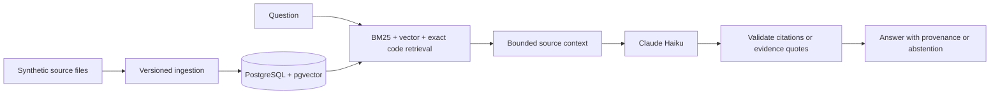

# Fintech RAG — auditable payment-policy retrieval

A portfolio project demonstrating data ingestion, hybrid retrieval, bounded LLM answers, automated testing, and cloud operations. The shipped demo uses **six synthetic payment-policy documents**, not current Nacha guidance or customer data.

## What it demonstrates

- **Reliable ingestion:** content and pipeline fingerprints, atomic version activation, archived versions, per-source writer locks, and unchanged-source replay without duplicate chunks.
- **Hybrid retrieval:** pinned BGE-small embeddings, PostgreSQL/pgvector, BM25, reciprocal-rank fusion, exact return-code lookup, and preservation of conflicting vendor evidence.
- **Bounded answers:** source/version/hash references, validated inline citations, explicit abstention, request/context/output limits, and exact evidence extraction for comparison questions.
- **Delivery:** 84 automated tests, real-embedding retrieval checks, offline CPU container verification, immutable ARM images, Terraform, and GitHub Actions with short-lived AWS OIDC credentials.
- **Operations:** private SSM execution, CloudWatch logs and outcome metrics, encrypted versioned backups, restore verification, dependency failure/recovery checks, and automatic instance shutdown.



## Verified evidence

| Check | Result | Evidence |
|---|---|---|
| Unit, API and PostgreSQL contracts | 84 tests | [CI](https://github.com/ezhilan03/fintech-rag/actions/workflows/ingestion.yml) |
| Real BGE + pgvector retrieval | 7/7 controlled cases | [Retrieval evidence](eval/evidence/) |
| Live Haiku grounded answers | 8/8 controlled-context cases | [Evidence review](eval/evidence/REVIEW.md) |
| AWS release, backup/restore and recovery | Passed; host stopped | [Release evidence](docs/RELEASE-0.2.0.md) |

The eight grounding cases isolate generation from retrieval; they are not an end-to-end accuracy estimate. The seven retrieval cases are a small synthetic regression suite. Earlier failed runs remain in the evidence directory. No claim of comprehensive compliance correctness or an independently audited production service is made.

## Local use

Python 3.11, Docker and uv are required. Copy `.env.example` to `.env` and supply your own database URL and Anthropic credential. Never commit this file.

```bash
uv sync --frozen --only-group runtime --only-group ingestion-test
# Use a PostgreSQL database with the vector extension installed.
uv run --no-sync python -m src.ingestion.demo
uv run --no-sync uvicorn src.api.app:app --host 127.0.0.1 --port 8000
```

Open `http://127.0.0.1:8000/docs`. Try “Compare the R01 retry windows in the Alpha and Beta policies” and “What is the policy for R99?” The former should return cited evidence from both synthetic vendors; the latter should abstain.

```bash
RAG_TEST_DATABASE_URL=postgresql://... uv run --no-sync pytest tests -q
# Production image bundles its pinned embedding snapshot and runs as UID 1000.
docker build --target production -t fintech-rag .
```

Test credentials must point to a disposable test database. Live grounding evaluation is optional and paid; see `eval/grounding.py` for its explicit spend guard. Ordinary CI does not call Anthropic.

## AWS demo operation

The demo is deliberately **on demand**, with no public API port. Run **Release and verify AWS demo** from the `main` branch in GitHub Actions. The workflow checks the code, publishes an immutable image, starts the designated host, invokes a restricted SSM document, verifies the application and recovery, uploads evidence, and stops the host in a final cleanup step. An independent host timer stops it after one hour if the workflow is interrupted.

Each run stores a manifest, report and PostgreSQL backup in a private S3 bucket. Reports contain synthetic query evidence, never credentials. Runtime credentials come from an SSM SecureString; Terraform state does not contain the Anthropic key. Infrastructure state is kept outside Git. See [operations](docs/OPERATIONS.md) for bootstrap and recovery.

The cost target is **under $5/month combined with Recon during light demo use**, not a hard billing cap. The retained RAG disk is 12 GB; instances, public IPv4, image storage, backups, logs and model calls add usage charges. Both demo hosts should remain stopped between runs. Account-wide budget warnings are configured separately. No always-on load balancer, NAT gateway, or managed database is required.

## Scope and tradeoffs

This is a single-host engineering demonstration, not a highly available or public multi-tenant service. Host failure recovery, authentication for public access, load testing, independent answer audits, and a broader authoritative corpus would be required before a real customer deployment. Citation validation checks provenance, not semantic truth. Comparison detection covers explicit comparison wording; it is not a general reasoning verifier. Database backups are on demand, not continuous point-in-time recovery.

The [legacy README](docs/LEGACY-README.md) preserves earlier experiment notes and scores. Its hosted links and production claims are historical and are not the current release contract.
